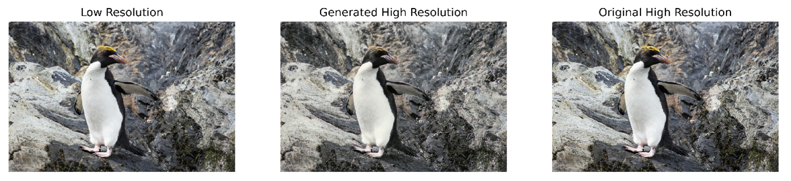
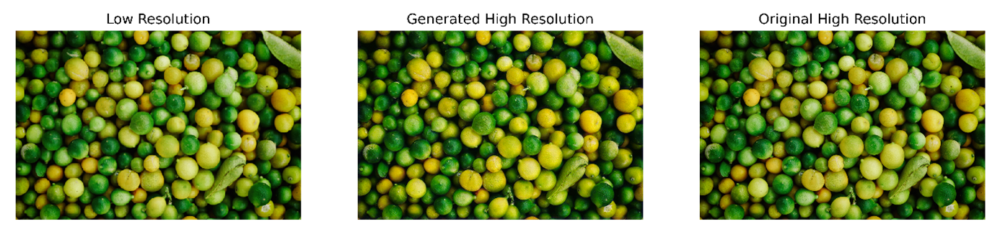
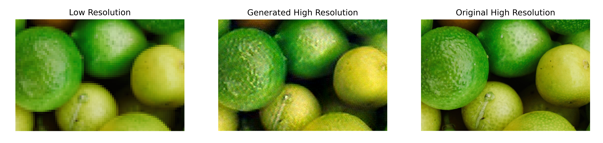
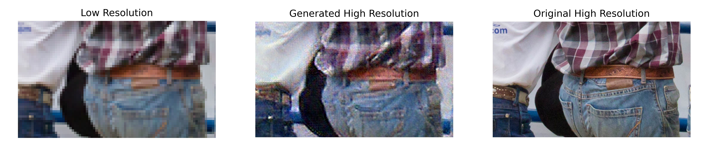

# FreeSRonPython

## Installation

1. **Create a virtual environment** (Finished in this zip):
   
   &nbsp;&nbsp;&nbsp;&nbsp;python -m venv venv

2. **Activate the virtual environment**:

   &nbsp;&nbsp;&nbsp;&nbsp;venv\Scripts\activate

3. **Install Python packages** (Finished in this zip):

   &nbsp;&nbsp;&nbsp;&nbsp;pip install -r requirements.txt

4. **Start the app**:

   &nbsp;&nbsp;&nbsp;&nbsp;python app.py

## Project Showcase

**Full Picture:**

**6x magnification:**

The following shows the results of the model after 320 training cycles. In actual tests, the effect increases slightly with the number of training cycles, and remains basically unchanged after 600 training cycles.
